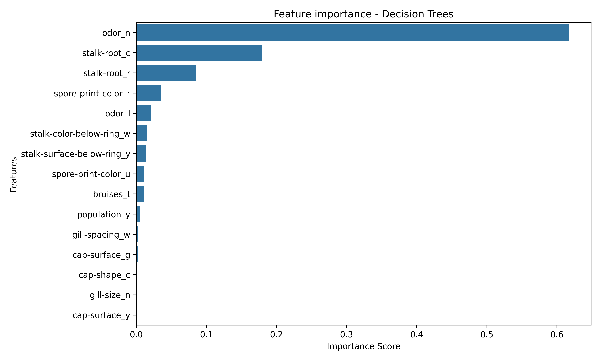
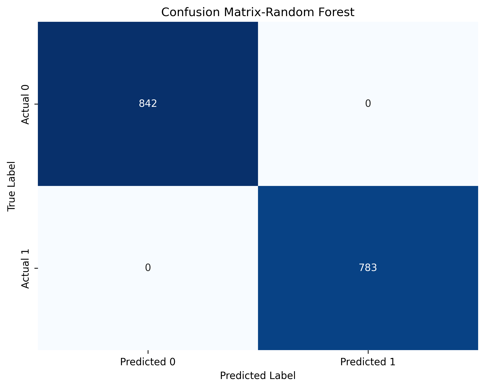
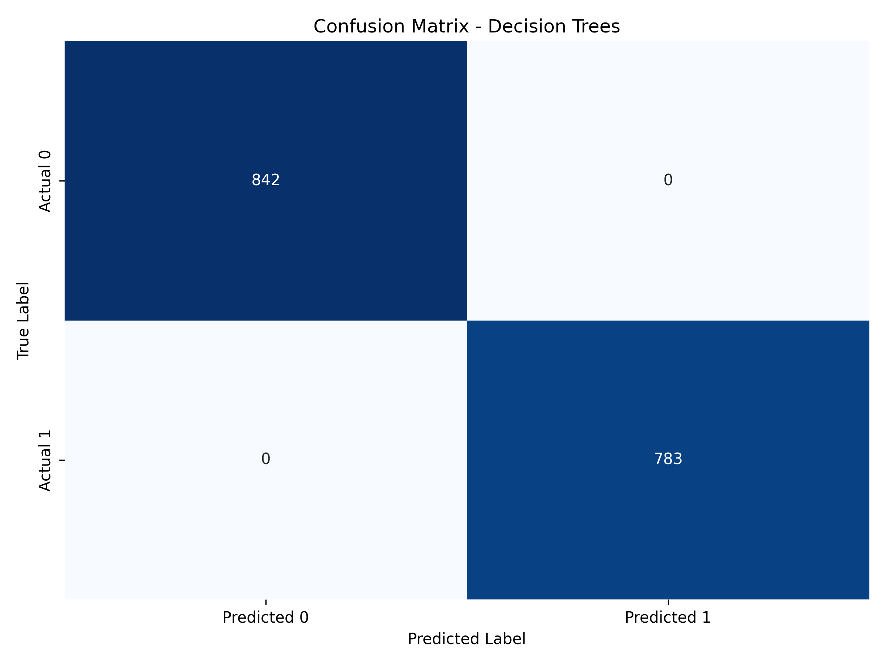
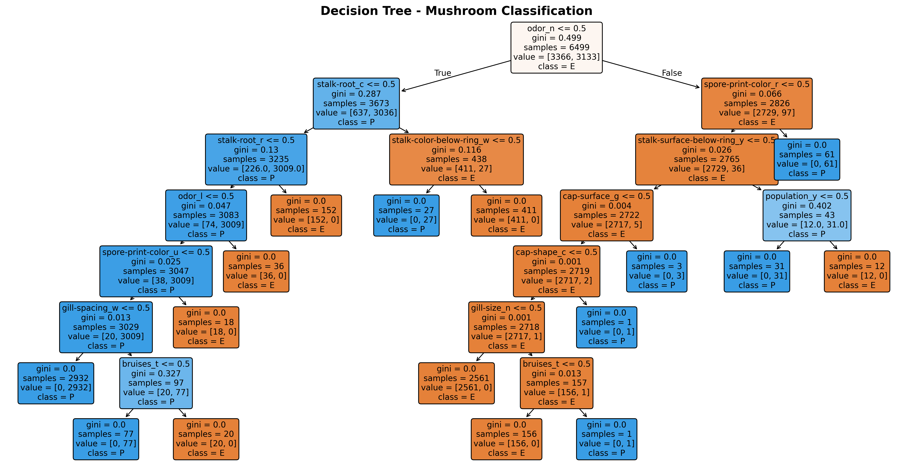

# Mushroom Classification Project

## Project Overview
This project focuses on predicting whether a mushroom is **Edible** or **Poisonous** based on its physical and biological specifications. Utilizing the classic UCI Mushroom dataset, this repository demonstrates how to handle dense categorical spaces cleanly and build highly stable, fully optimized tree-based models. 

---

## Key Learnings

### 1. One-Hot Encoding
- Instead of forcing arbitrary numerical orders (e.g., mapping colors or smells to 0, 1, 2, 3) which tricks tree splits into assuming fake hierarchies, `pd.get_dummies(dtype=int)` was introduced. This splits the data into distinct, clean true/false features, ensuring the algorithm evaluates structural presence rather than mathematical ranking.

### 2. Shuffled Stratified K-Fold Cross-Validation
- **Implementation:** The raw dataset is physically grouped by mushroom family species. Utilizing `StratifiedKFold(n_splits=5, shuffle=True)` forces an even distribution of classes across all folds, permanently stabilizing the model variance down to a near-zero threshold.

### 3. Hyperparameter Optimization via GridSearchCV
- **Implementation:** Instead of running unbounded models (`max_depth=None`), `GridSearchCV` was coupled with our custom stratified CV strategy. This restricted and searched for the optimal operational thresholds, capping the **Decision Tree at a max depth of 7** and the **Random Forest ensemble at a max depth of 8**.

---

## Feature Importances & Model Interpretability
One-Hot Encoding unlocked microscopic insight into how the models draw boundaries. Rather than stating that "odor" is generally important, the models reveal that the specific absence of any odor (`odor_n`) is the strongest indicator of an edible mushroom, whereas a foul odor (`odor_f`) strongly dictates toxicity.

### Random Forest Feature Importance

### Decision Tree Feature Importance

---

## Model Evaluation

### Confusion Matrices
Both models successfully mapped the underlying biological patterns of the dataset, achieving optimal separation on the unseen test matrix.

| Random Forest Confusion Matrix | Decision Tree Confusion Matrix |
|:---:|:---:|
|  |  |

### Structural Tree Path Visualization
The single Decision Tree maps out the entire dataset logic cleanly across exactly 7 sequential layers, making it highly interpretable for immediate, real-world deployment.

---

## Conclusion & Verdict
* **The Performance Ceiling:**  Because the mushroom dataset is entirely deterministic (toxicity follows strict biological rules with zero random noise), both regularized architectures successfully converge at **100.00% accuracy** on unseen data without overfitting.
* **Final Recommendation:**  For production environments, the **Decision Tree Classifier** stands out as the optimal model choice. It achieves identical performance to the ensemble while running on a single 7-layer layout, requiring less memory, and delivering an exceptionally transparent, step-by-step checklist suitable for immediate deployment.